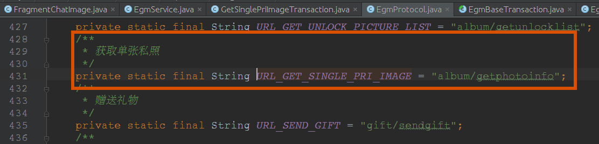

## WHY REPLACE
	1.	旧框架接口复杂，使用繁琐
	2.	效率低下
	3.	基于HttpClient实现
		Android6.0不再支持HttpClient，需要需要在Android6.0机器上使用，需要在apk包中集成HttpClient的库

#### 旧框架接口复杂，使用繁琐
	1. 一个普通的网络请求需要做出10处修改
	2. 很难根据网络请求追踪到网络返回，反之亦然
	3. 回调对象不能及时被回收，占用内存
	4. 对多次相同网路请求处理繁琐

#### 一条网路请求的套路
	

## WHAT WE WANT
	1. 接口简单，使用方便
	2. 易于扩展和替换
	3. 方便监控
	4. 高性能

## HOW TO MAKE IT
	类图
	时序图
	okhttp实现，okhttp原理

## MORE
